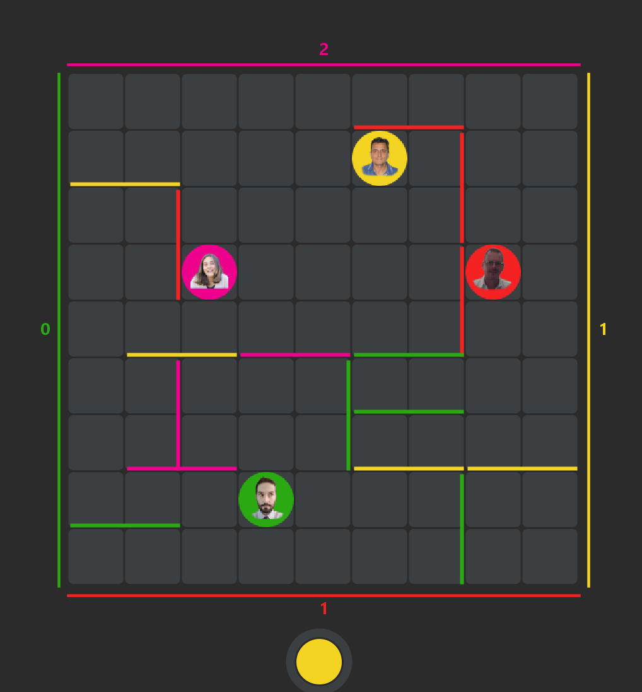

# The Great Escape AI

**The Great Escape AI** is a strategic board game implementation where 4 intelligent agents compete to reach the opposite side of the board. This project utilizes **Answer Set Programming (ASP)** to power the reasoning and decision-making processes of the agents, making them act rationally based on defined rules, action weights, and the current state of the world.

## 📖 Project Overview

<p align="center">
  
</p>

The game involves 4 players starting at the center of each side of a 9x9 grid. The objective is to be the first to reach any cell on the opposite side. Players can move one cell at a time or place walls to block opponents.

This project implements the game logic and integrates **4 distinct AI agents**, each developed by different teams/approaches, leveraging symbolic AI (ASP) via the **EmbASP** framework.

### Key Features
-   **Symbolic AI**: Agents use declarative logic to determine the best moves.
-   **ASP Integration**: Powered by `DLV2` and `Clingo` solvers.
-   **Multi-Agent System**: 4 unique agents with different strategies and behaviors.
-   **Cross-Platform**: Includes solvers for Windows, Linux, and macOS.

## 🤖 The AI Agents

The project features 4 custom-built AI agents. Each agent uses an ASP program to reason about the game state:

1.  **ASPetta & Infera** (`Agent1`): Uses `DLV2`. Focuses on optimal pathfinding.
2.  **Grissin Van Bon** (`Agent2`): Uses `DLV2` (with `aiDlv2.asp`). Implements advanced strategies:
    -   **Early Game**: Aggressive movement.
    -   **Mid/End Game**: "Paranoid" wall placement to hinder the leading opponent (`discardToAvvInitial`, `nearWinInitial`).
    -   **Heuristics**: Weak constraints to minimize distance to goal, avoid edges, and maintain distance from walls.
3.  **IRS** (`Agent3`): Uses `DLV2`.
4.  **JYPapi** (`Agent4`): Uses `DLV2`.

## 🛠️ Implementation Details

The project is built with **Java** and uses **EmbASP** (version 7.2.0) to bridge Java objects with ASP logic.

-   **Framework**: [EmbASP](https://github.com/DeMaCS-UNICAL/EmbASP)
-   **Solvers**: The `lib/` directory contains pre-packaged executables for `dlv2` and `clingo`.
-   **Game Model**: located in `it.unical.demacs.ai.model`.
-   **Encodings**: ASP logic files (e.g., `aiDlv2.asp`) define the rules for movement, wall placement, and winning conditions.

### How it works (ASP Logic)
The agents map the current game state (walls, player positions, dimensions) into "facts" (e.g., `player(ID,...).`, `wall(...).`). The ASP solver then computes the "Answer Sets" (solutions) which dictate the next best action:
-   `newPos(R,C)`: Move to a new cell.
-   `newWall(...)`: Place a wall to block an opponent.

## 🚀 Getting Started

### Prerequisites
-   **Java Development Kit (JDK)** 17 or higher.
-   **Maven** (for dependency management and building).

### Installation

1.  **Clone the repository**:
    ```bash
    git clone https://github.com/your-username/the-great-escape-ai.git
    cd the-great-escape-ai
    ```

2.  **Verify Solvers**:
    Ensure the `lib` folder contains the necessary solver executables (`dlv2`, `clingo`) for your operating system. They are included by default.

### How to Run

#### Option 1: Using an IDE (Recommended)
1.  Open the project in **IntelliJ IDEA** or **Eclipse**.
2.  Import as a **Maven Project**.
3.  Locate the main class: `src/main/java/it/unical/demacs/ai/App.java`.
4.  Run `App.main()`.

#### Option 2: Using Maven
You can build and run the project from the command line:

```bash
# Build the project
mvn clean install

# Run the application (using exec-maven-plugin if configured, or java -jar)
# Alternatively, compile and run the main class directly:
mvn exec:java -Dexec.mainClass="it.unical.demacs.ai.App"
```

## 📂 Project Structure

```
the-great-escape-ai/
├── lib/                # ASP solvers (dlv2, clingo) and local jars (embASP)
├── src/
│   └── main/
│       ├── java/       # Java source code
│       │   └── .../model/ai/   # Agent implementations
│       └── resources/  # Assets and images
├── pom.xml             # Maven configuration
└── README.md           # Documentation
```

## 👥 Credits
Developed at **University of Calabria (Unical)**.
Groups:
- Grissin Van Bon
- ASPetta & Infera
- IRS
- JYPapi